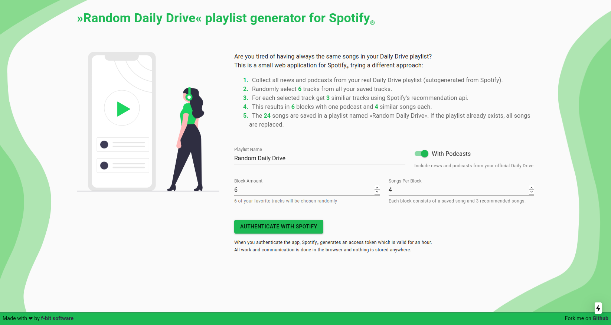

# Random Daily Drive

Generates and regenerates a playlist containing your daily podcasts from the original Daily Drive and your favorite songs mixed with recommendations from Spotify.  
Why this name? I was tired from having always the same or similiar songs in my Daily Drive while having lots of saved songs. So I wanted to have a better mix.



## Development

First, run the development server:

```bash
VITE_CLIENT_ID=<your_client_id> VITE_REDIRECT_URI=http://localhost:3000 yarn dev
```

Open [http://localhost:3000](http://localhost:3000) with your browser to see the result.

You can start editing the page by modifying `src/App.tsx`. The page auto-updates as you edit the file.

## License

MIT

## Feature Requests?

Feel free, to create an issue or a pull request.
